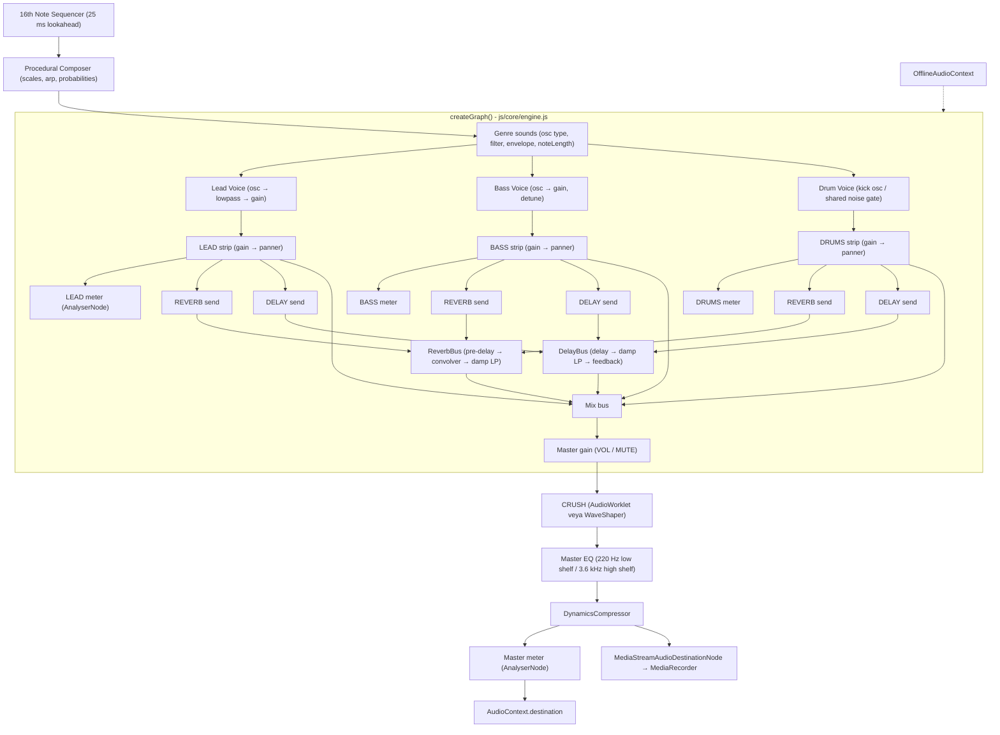

# 🏛️ Architecture & System Design - Retro 32-Bit Soundtrack Generator

## 📌 1. Project Overview
Retro 32-Bit Soundtrack Generator, tarayıcının Web Audio API'si üzerinde çalışan, tamamen prosedürel bir müzik
üreticisidir. Kaynak kod 25 ES modülüne ayrılmıştır; dağıtım için sıfır bağımlılıklı bir paketleyici ile tek dosya
sürümü de üretilebilir.

## 🛠️ 2. Technology Stack
- **Audio Synthesis Engine**: Web Audio API (`AudioContext`, `OscillatorNode`, `GainNode`, `StereoPannerNode`,
  `BiquadFilterNode`, `ConvolverNode`, `DelayNode`, `WaveShaperNode`, `DynamicsCompressorNode`, `AnalyserNode`,
  `MediaStreamAudioDestinationNode`, `OfflineAudioContext`)
- **AudioWorklet**: beyaz gürültü üreteci (`retro-noise`) ve bitcrush + yumuşak doygunluk (`retro-crush`)
- **Visualizer**: DOM tabanlı görselleştirici, adım sayısına göre büyür; notalar `AudioContext.currentTime`
  ile eşleştirilerek oynatılır
- **Recording / Export**: `MediaRecorder` (WebM/Ogg), elle yazılmış SMF yazıcı, 16-bit PCM WAV kodlayıcı
- **Sharing**: preset'in base64url ile URL hash'ine sıkıştırılması
- **Offline / PWA**: Service worker ön belleği, web manifesti, prosedürel PNG ikonlar
- **UI**: Vanilla HTML5 + CSS3 (neon/CRT, açık ve koyu tema), ES modülleri, harici paket yok

## 📐 3. Web Audio Node Graph



Canlı bağlam ve çevrimdışı render **aynı `createGraph()` fonksiyonunu** kullanır; `applyMixer()` mixer durumunu her
iki ortamda da aynı şekilde düğümlere yazar.

## 🧩 4. Module Boundaries

| Modül | Sorumluluk | Bağımlılıklar |
| --- | --- | --- |
| `core/theory.js` | Nota adı ↔ MIDI, transpozisyon, adım/adım uzunluğu yardımcıları | — |
| `core/scales.js` | 11 gam tanımı, kök nota türetme, gamdan nota dizisi üretme | theory |
| `core/genres.js` | 7 türün verisi: tempo, gamlar, ses parametreleri, mixer varsayılanları | mixer-state |
| `core/composer.js` | Prosedürel beste üretimi, dizi temizleme, uzunluğa döşeme | theory, scales |
| `core/song-settings.js` | Şarkı ayarları şeması ve kırpma (adım, nota, arpej, ölçek) | theory, scales |
| `core/mixer-state.js` | Mixer şeması, EQ bantları, sınırlamalar, yol bazlı güncelleme | theory |
| `core/instruments.js` | Lead/bass/davul sesleri, nota kapısı, paylaşımlı gürültü havuzu | theory, composer |
| `core/effects.js` | Reverb (pre-delay + convolver), delay bus'ı, master EQ | theory, mixer-state |
| `core/crush.js` | CRUSH işleyicisi: AudioWorklet veya WaveShaper eğrisi | theory |
| `core/engine.js` | Graf kurucu, transport, zamanlayıcı, olay yayını, çevrimdışı render | yukarıdakiler + worklets |
| `io/midi.js` | Standart MIDI File yazıcı | theory, composer |
| `io/wav.js` | 16-bit PCM WAV kodlayıcı | — |
| `io/share.js` | Paylaşım bağlantısı kodlama/çözme | — |
| `io/presets.js` | localStorage + JSON preset deposu, oturum kaydı | genres, composer, song-settings, mixer-state |
| `io/recorder.js` | MediaRecorder sarmalayıcı | — |
| `ui/*` | Bileşenler ve paneller (DOM tarafı) | core/*, io/presets, io/share |
| `worklets/*` | AudioWorklet kaynakları ve blob tabanlı kayıt | — |
| `main.js` | Önyükleme, olay bağlama, kısayollar, oturum kaydı, PWA kaydı | tümü |

Bağımlılık yönü tek yönlüdür; `core` katmanı DOM'a, `ui` katmanı `AudioContext`'e doğrudan dokunmaz.

## 📂 5. Project Layout
```text
Retro-32-Bit-Soundtrack/
├── index.html                  # Uygulama kabuğu + tema ön yükleme betiği
├── manifest.webmanifest        # PWA bildirimi
├── sw.js                       # Service worker
├── package.json                # Geliştirme betikleri (bağımlılık yok)
├── assets/                     # SVG + PNG ikonlar
├── css/main.css                # Arayüz stilleri (koyu/açık tema)
├── js/                         # ES modülleri (core, io, ui, worklets)
├── tools/                      # build.mjs, check.mjs, make-icons.mjs
├── docs/KNOWLEDGE.md           # Müzik ve dosya formatı bilgisi
├── dist/                       # Üretilen tek dosya paket (git'e dahil değil)
├── README.md, ARCHITECTURE.md, ROADMAP.md, CHANGELOG.md, GEMINI.md
├── LICENSE
└── brain/                      # Proje yönetimi (git'e dahil değil)
```

## ⏱️ 6. Timing Model
- Zamanlayıcı 25 ms'de bir `setTimeout` ile çalışır ve 120 ms ileriye bakışta notaları planlar.
- Adım uzunluğu `60 / bpm / 4` saniyedir; `nextNoteTime` yalnızca ses bağlamının saatinden okunur.
- Görsel olaylar zaman damgalı kuyrukta tutulur ve `requestAnimationFrame` döngüsünde `currentTime` eşleştiğinde
  görselleştiriciye verilir. Sekme gizlendiğinde zamanlayıcı yeniden senkronlanır.
- Ses parametreleri 10 ms'lik `setTargetAtTime` ile uygulanır, darbe anında değil.
- Adım sayısı çalışma zamanında değişebilir (16/32/64); uzunluk artarken desen tekrar ederek döşenir, azalırken
  kırpılır.

## 🧪 7. Doğrulama
- `tools/check.mjs` (309 kontrol): tüm modüllerin sözdizimi denetimi + saf mantık testleri (nota dönüşümleri, gam
  üretimi, tür verileri, beste, şarkı ayarları, mixer kırpma, efekt parametreleri, ses otomasyonu, node grafiği,
  çevrimdışı render, AudioWorklet ve WaveShaper DSP'si, MIDI ayrıştırma, WAV başlığı, paylaşım kodu, preset deposu,
  manifest, service worker ön belleği ve paket bütünlüğü).
- Tarayıcı doğrulaması (headless Edge, senaryo başına 56 kontrol): modüler sürüm (HTTP, AudioWorklet + service
  worker), paketlenmiş sürüm (HTTP) ve paketlenmiş sürüm (`file://`, WaveShaper/buffer yedeği). WAV ve MIDI
  dosyaları indirilip diskten yeniden doğrulanır.
