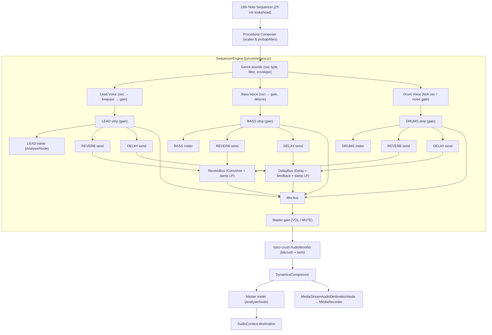

# 🏛️ Architecture & System Design - Retro 32-Bit Soundtrack Generator

## 📌 1. Project Overview
Retro 32-Bit Soundtrack Generator, tarayıcının Web Audio API'si üzerinde çalışan, tamamen prosedürel bir müzik
üreticisidir. Kaynak kod ES modüllerine ayrılmıştır; dağıtım için sıfır bağımlılıklı bir paketleyici ile tek dosya
sürümü de üretilebilir.

## 🛠️ 2. Technology Stack
- **Audio Synthesis Engine**: Web Audio API (`AudioContext`, `OscillatorNode`, `GainNode`, `BiquadFilterNode`,
  `ConvolverNode`, `DelayNode`, `DynamicsCompressorNode`, `AnalyserNode`, `MediaStreamAudioDestinationNode`)
- **AudioWorklet**: beyaz gürültü üreteci (`retro-noise`) ve bitcrush + yumuşak doygunluk (`retro-crush`)
- **Visualizer**: DOM tabanlı 32 adımlık görselleştirici (nota zamanları `AudioContext.currentTime` ile eşleştirilir)
- **Recording Engine**: `MediaRecorder` (WebM/Opus, mümkünse Ogg)
- **MIDI Export**: elle yazılmış Standart MIDI File (SMF) yazıcısı
- **Offline / PWA**: Service worker ön belleği, web manifesti, prosedürel PNG ikonlar
- **UI**: Vanilla HTML5 + CSS3 (neon/CRT), ES modülleri, harici paket yok

## 📐 3. Web Audio Node Graph



## 🧩 4. Module Boundaries

| Modül | Sorumluluk | Bağımlılıklar |
| --- | --- | --- |
| `core/theory.js` | Nota adı ↔ MIDI numarası, frekans dönüşümü, kırpma | — |
| `core/genres.js` | Tür tanımları ve varsayılan ses parametreleri | — |
| `core/composer.js` | Prosedürel beste üretimi, preset veri temizleme | theory |
| `core/mixer-state.js` | Mixer şeması, varsayılanlar, kırpma ve yol bazlı güncelleme | theory |
| `core/instruments.js` | Lead/bass/davul sesleri, paylaşımlı gürültü havuzu | theory, composer |
| `core/effects.js` | Reverb impuls yanıtı üretimi, delay bus'ı | theory |
| `core/engine.js` | AudioContext grafiği, transport, zamanlayıcı, olay yayını | yukarıdakiler + worklets/registry |
| `io/*` | MIDI yazımı, preset deposu, kayıt, indirme | core/* |
| `ui/*` | Fader/mute/VU bileşenleri, mixer ve preset arayüzü | core/*, io/presets |
| `worklets/*` | AudioWorklet kaynakları ve blob tabanlı kayıt | — |
| `main.js` | Önyükleme, olay bağlama, kısayollar, oturum kaydı, PWA kaydı | tümü |

Bağımlılık yönü tek yönlüdür; `core` katmanı DOM'a, `ui` katmanı `AudioContext`'e doğrudan dokunmaz.

## 📂 5. Project Layout
```text
Retro-32-Bit-Soundtrack/
├── index.html                  # Uygulama kabuğu
├── manifest.webmanifest        # PWA bildirimi
├── sw.js                       # Service worker
├── package.json                # Geliştirme betikleri (bağımlılık yok)
├── assets/                     # SVG + PNG ikonlar
├── css/main.css                # Arayüz stilleri
├── js/                         # ES modülleri (core, io, ui, worklets)
├── tools/                      # build.mjs, check.mjs, make-icons.mjs
├── docs/KNOWLEDGE.md           # Müzik ve dosya formatı bilgisi
├── dist/                       # Üretilen tek dosya paket (git'e dahil değil)
├── README.md, ARCHITECTURE.md, ROADMAP.md, CHANGELOG.md, GEMINI.md
├── LICENSE
└── brain/                      # Proje yönetimi (git'e dahil değil)
```

## ⏱️ 6. Timing Model
- Zamanlayıcı 25 ms'de bir `setTimeout` ile çalışır ve 120 ms ileriye bakışta notaları planlar.
- Adım uzunluğu `60 / bpm / 4` saniyedir; `nextNoteTime` yalnızca ses bağlamının saatinden okunur.
- Görsel olaylar zaman damgalı kuyrukta tutulur ve `requestAnimationFrame` döngüsünde `currentTime` eşleştiğinde
  görselleştiriciye verilir. Sekme gizlendiğinde zamanlayıcı yeniden senkronlanır.
- Ses parametreleri 10 ms'lik `setTargetAtTime` ile uygulanır, darbe anında değil.

## 🧪 7. Doğrulama
- `tools/check.mjs`: tüm modüllerin sözdizimi denetimi + saf mantık testleri (nota dönüşümleri, tür verileri, beste,
  mixer kırpma, efekt parametreleri, ses otomasyonu, AudioWorklet DSP'si, MIDI ayrıştırma, preset deposu, paket
  bütünlüğü, manifest ve service worker ön belleği).
- Tarayıcı doğrulaması: modüler sürüm (HTTP, AudioWorklet + service worker), paketlenmiş sürüm (HTTP) ve
  paketlenmiş sürüm (`file://`, yedek kaynak) senaryolarında uçtan uca çalıştırıldı.
